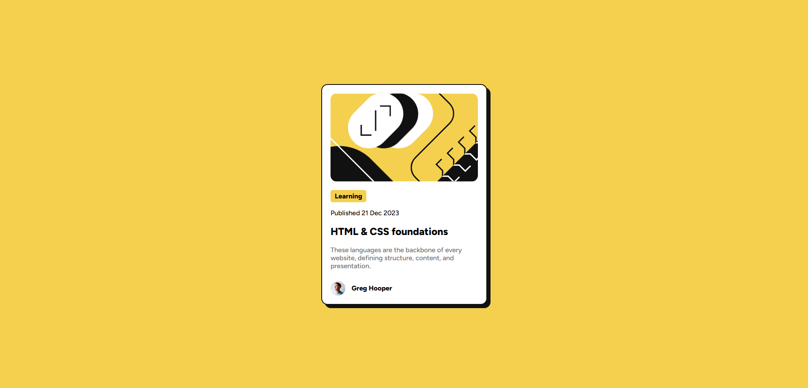

# Frontend Mentor - Blog preview card solution

This is a solution to the [Blog preview card challenge on Frontend Mentor](https://www.frontendmentor.io/challenges/blog-preview-card-ckPaj01IcS). Frontend Mentor challenges help you improve your coding skills by building realistic projects.

## Table of contents

- [Overview](#overview)
  - [The challenge](#the-challenge)
  - [Screenshot](#screenshot)
  - [Links](#links)
- [Built with](#built-with)
- [Author](#author)

## Overview

### The challenge

Users should be able to:

- See hover and focus states for all interactive elements on the page

### Screenshot

### Links

- Solution URL: [Github Repository](https://github.com/Gbw699/Blog-preview-card-frontend-mentor)
- Live Site URL: [Vercel Deployment](https://blog-preview-card-gbw699.vercel.app/)

## My process

### Built with

- Semantic HTML5 markup
- Responsive Desing
- [Angular 18](https://v18.angular.dev/)
- [SASS](https://sass-lang.com/) for styles

## Author

- Frontend Mentor - [@Gbw699](https://www.frontendmentor.io/profile/Gbw699)
- Linkedin - [@Gabriel Barimboim](https://www.linkedin.com/in/gabriel-barimboim/)
